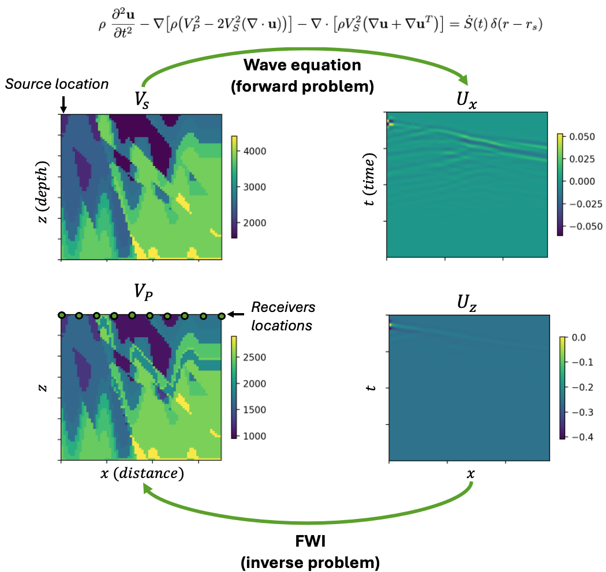

<!-- markdownlint-disable -->
# Diffusion Model for Full-Waveform Inversion (FWI)

## Problem Overview 

Full Waveform Inversion (FWI) is a seismic imaging technique that reconstructs
subsurface properties, also called velocity model, by fitting the recorded
seismic waveform. It underpins a range of applications, including:

- Hydro-carbon exploration and production, where an accurate velocity model
  guides drilling decisions.
- CO₂ storage, ensuring the integrity of underground reservoirs used
  for carbon capture and sequestration.
- Global and regional seismology, helping characterise tectonic processes and
  earthquakes.
- Analogous elastic/acoustic imaging modalities such as medical ultrasound and
  non-destructive testing.

The present example is tailored to the elastic wave equation in the context of
hydro-carbon exploration, but the same framework can be applied to other wave
equations and applications.

The following introduces a few key concepts that are essential to FWI in the context of
hydro-carbon exploration:

- *Velocity model* $\mathbf{x}(r)=\bigl[
  V_\mathrm{P},\,V_\mathrm{S},\,\rho \bigr]$ – a 3-D image over
  coordinates $r = (z,x,y)$, where $z$ is the depth, and $x$ and $y$ are the
  surface coordinates. The P-wave velocity is denoted by $V_\mathrm{P}$, the
  S-wave velocity by $V_\mathrm{S}$, and $\rho$ is the density. The velocity
  model spans several kilometres and is discretised at metre-scale resolution.

- *Sources / shots* – positions $r_s = (0, x_s, y_s)_{1 \leq s \leq S}$ where independent
  excitations are fired; typically thousands of shots distributed along the
  surface. The cost associated with acquiring these shots and processing the
  data is a major component of the total cost of the FWI.

 <!-- TODO: make sure those are really the particle-velocity components. And make sure the name and math notation is consistent throughout -->
 <!-- TODO: make sure the time-resolution is correct -->
- *Receivers* – sensors at locations $r_i = (0, x_i, y_i)_{1 \leq i \leq R}$ that record
  horizontal particle-velocity components $u_x$ and $u_y$ and vertical
  particle-velocity component $u_z$ at the surface. Receivers are typically
  arranged in a 2-D grid of $\mathcal{O}(10^3)$ sensors with a few-meter
  spacing and record data with a time-resolution of a few tenth of seconds.

- *Seismic observations* - the particle-velocity components recorded at all
  receivers for a given shot $s$ can be combined into a 3D image $y_s = [u_z, u_x, u_y]$ over
  coordinates $(t, x_i, y_i)$ that contains reflections, refractions and
  surface waves. The $S$ independent sources can be further combined to form a
  large set $Y$ of 3D observations.

The goal of FWI is to reconstruct the velocity model $\mathbf{x}(r)$ from the
entire set of seismic observations $Y$. To do so, standard FWI uses classical
optimization techniques combined with the elastic wave equation, defined below.

<p align="center">

</p>

$$
\mathcal{A}_{\mathbf{x}} \{\mathbf{u}\} (r, t) = \dot{S}(t)\,\delta(r-r_s)  \tag{1}
$$
 where $\dot{S}(t)\,\delta(r-r_s)$ is the source at location $r_s$ with time
 signal $\dot{S}(t)$, and $\mathcal{A}_{\mathbf{x}}$ is the elastic wave
 operator defined by:

 $$
\mathcal{A}_{\mathbf{x}} \{\mathbf{u}\} = \rho\ \frac{\partial^{2}
\mathbf{u}}{\partial t^{2}} - \nabla \bigl[  \rho \bigl( V^2_P - 2
V^2_S (\nabla \cdot \mathbf{u})  \bigr) \bigr] - \nabla \cdot \bigl[ \rho
V^2_S \bigl( \nabla \mathbf{u} + \nabla \mathbf{u}^T \bigr) \bigr] 
$$

We denote $\mathcal{R} (\mathbf{x}, s)$ the solution operator associated to the
wave equation $(1)$. This operator maps a velocity model $\mathbf{x}$ and a
source $\dot{S}(t)\,\delta(r-r_s)$ to the solution of the PDE at the receiver
locations: it therefore provides a simulated seismic observation $\hat{y}_s$.

FWI seeks to solve an inverse problem of finding the velocity model $\mathbf{x}$
that best fits the observed seismic data $Y$. Given observed data, standard FWI
uses classical optimization techniques to solve the following minimization
problem:

$$
\mathbf{x}^* = \arg \min_{\mathbf{x}} \Phi(\mathbf{x}) = \sum_{s=1}^{S} \bigl\|
\mathcal{R} (\mathbf{x}, s) - y_s \bigr\|_2^{2}
$$

In realistic conditions (limited number of observations, limited resolution,
noise), the inverse problem defined by this equation is ill-posed
(that is, it has multiple solutions). This one-to-many mapping is the main
difficulty of FWI and makes it particularly suitable to be solved with
generative models. This example uses a diffusion model to solve the FWI inverse
problem.


## Getting Started

This example requires basic knowledge of [denoising diffusion
models](../../generative/README.md); it is also recommended to be familiar with
other examples using diffusion models, such as
[StormCast](../../weather/stormcast/README.md) or
[CorrDiff](../../weather/corrdiff/README.md).

Start by installing PhysicsNeMo (if not already installed) and copying this
folder (`examples/geophysics/diffusion_fwi`) to a system with a GPU available.
This example comprises a succession of three steps:

1. [Dataset preprocessing](#dataset-preprocessing)
2. [Training](#training)
3. [Sampling and model evaluation](#sampling-and-model-evaluation)

## Dataset Preprocessing

This examples builds on the [E-FWI
dataset](https://smileunc.github.io/projects/efwi/datasets), initially
published as [E-FWI: Multi-parameter Benchmark Datasets for Elastic Full
Waveform Inversion of Geophysical
Properties](https://arxiv.org/abs/2306.12386). We complement the original
dataset by providing a data generation pipeline to: 

(1) expand the dataset to the case of variable density $\rho(r)$
(2) generate particle-velocity observations from veloicty models in a consistent manner

> **⚠️  Warning:** The E-FWI dataset is distributed under a non-commercial license [CC
> BY-NC-SA 4.0](https://creativecommons.org/licenses/by-nc-sa/4.0/).

### Step 1: Download and Reorganize the E-FWI Dataset

Download the E-FWI dataset. Because the E-FWI
dataset is composed of multiple sub-datasets (CFB, CFA, FVB), we provide
utility functions to merge them into a single dataset and reorganize the data
into a more convenient format. 

To pre-process the entire dataset, navigate to the `./data` directory and run:

```bash
python download_data.py --download --reorganize --clean --shuffle --name all
```

This will download the dataset as a collection of `.npz` files in the directory
`./data/all/samples`. For more information about the possible options, run:

```bash
python download_data.py --help
```

>**Note:** Depending on how many subsets of the E-FWI dataset you want to
>download, the size of the dataset can be quite large (from 100GB to 1TB);
>downloading the full dataset can take several hours.

### Step 2: Generate Seismic Observations

Regenerate seismic observations from the
velocity models with variable density. The original wave speeds $V_\mathrm{P}$ and
$V_\mathrm{S}$ from the E-FWI datasets are retained and the density is generated
by the `generate_data.py` script. This script then solve an elastic wave
equation using [Deepwave](https://zenodo.org/records/8381177) to generate the
seismic observations. Because this step can be time-consuming, it is advised to
do it on a machine with multiple GPUs. To do so, still in the `./data` directory run:

```bash
python generate_data.py --in_dir ./all --out_dir <path_to_output_directory>
```

This script will generate a new set of `.npz` files in the directory
`<path_to_output_directory>/samples`.

### Step 3: Compute Dataset Statistics

For the dataset preprocessing, compute statistics of
the train and test sets by running:

```bash
python compute_stats.py --dir <path_to_output_directory> --batch_size 512 --num_workers 4
```

This script will compute the dataset statistics and save them in the file
`<path_to_output_directory>/stats.json`. It supports distributed processing
based on `torch.distributed`, so it is advised to run it on a machine with
multiple GPUs. If doing so, replace the `python` command with:

```bash
torchrun --standalone --nnodes=<NUM_NODES> --nproc_per_node=<NUM_GPUS_PER_NODE> compute_stats.py --dir <path_to_output_directory> --batch_size 512 --num_workers 4
```

After these steps are completed, verify that you have a dataset ready to be used for
training.

## Training

>**Configuration Basics**
>
>Training is handled by `train.py`, configured using
>[Hydra](https://hydra.cc/docs/intro/) based on the contents of the `config`
>directory. Hydra allows for YAML-based modular and hierarchical configuration
>management and supports command-line overrides for rapid testing and
>experimentation. The `conf/config_train.yaml` file includes the default
>parameters for training a diffusion model for FWI. It contains some fields
>that must be provided by you at runtime. This can be done by directly
>editing the `conf/config_train.yaml` file (or a copy of it), or by using hydra
>overrides. For example, to specify a dataset and use a different batch size, one
>can run:
>
>```bash
>python train.py --config-name=config_train ++dataset.directory=<path_to_dataset_directory> ++training.batch_size_per_device=1024
>```
>


At runtime, Hydra will parse the config subdirectory and command line
overrides into a runtime configuration object `cfg`, which will have all
settings accessible through both attribute or dictionary-like interfaces. For
example, the batch size per device can be accessed either as
`cfg.training.batch_size_per_device` or `cfg['training']['batch_size_per_device']`.

The training script `train.py` will initialize the training experiment and launch
the main training loop.

If running on a machine with multiple GPUs, the training script can be
parallelized with Distributed Data Parallel (DDP). To do so, run:

```bash
torchrun --standalone --nnodes=<NUM_NODES> --nproc_per_node=<NUM_GPUS_PER_NODE> train.py --config-name=config_train ++dataset.directory=<path_to_dataset_directory> ++training.batch_size_per_device=1024
```

<!-- TODO: add comments on the output + logging -->
<!-- TODO: add details about model + EDM + denoising score matching -->

## Sampling and Model Evaluation

### Zero-Shot Sampling

<p align="center">

</p>

### Physics-informed sampling

<p align="center">

</p>

## References

> **⚠️  Warning:** The E-FWI dataset is distributed under a non-commercial license [CC
> BY-NC-SA 4.0](https://creativecommons.org/licenses/by-nc-sa/4.0/).
- [E-FWI: Multi-parameter Benchmark Datasets for Elastic Full Waveform Inversion of Geophysical Properties](https://arxiv.org/abs/2306.12386)
- [E-FWI datasets](https://smileunc.github.io/projects/efwi/datasets)
- [Deepwave (Richardson A.)](https://zenodo.org/records/8381177)
- [Diffusion Posterior Sampling for General Noisy Inverse Problems](https://arxiv.org/abs/2209.14687)

